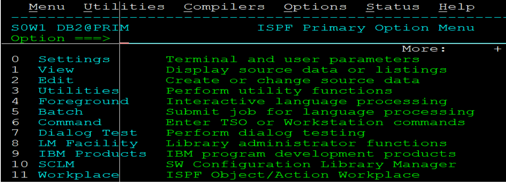
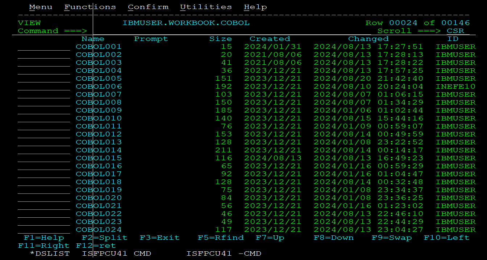

# Formação COBOL - 202401

## Menu ISPF

Programas desenvolvidos em classe

[Modulo I](Modulo-1)

Introdução ao COBOL

Primeiros programas

Uso de variáveis

Comando Perform

[Modulo II](Modulo-II)

Uso avançado de variáveis

Calculo

Tabelas Internas

Subprogramas

Aritmética

